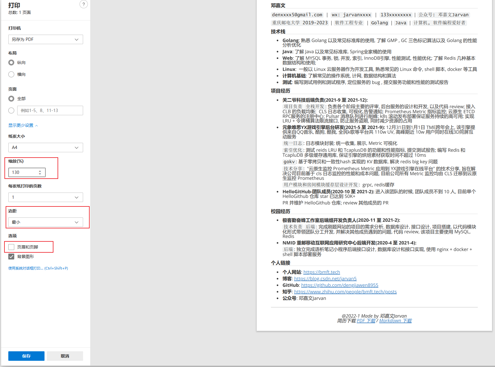
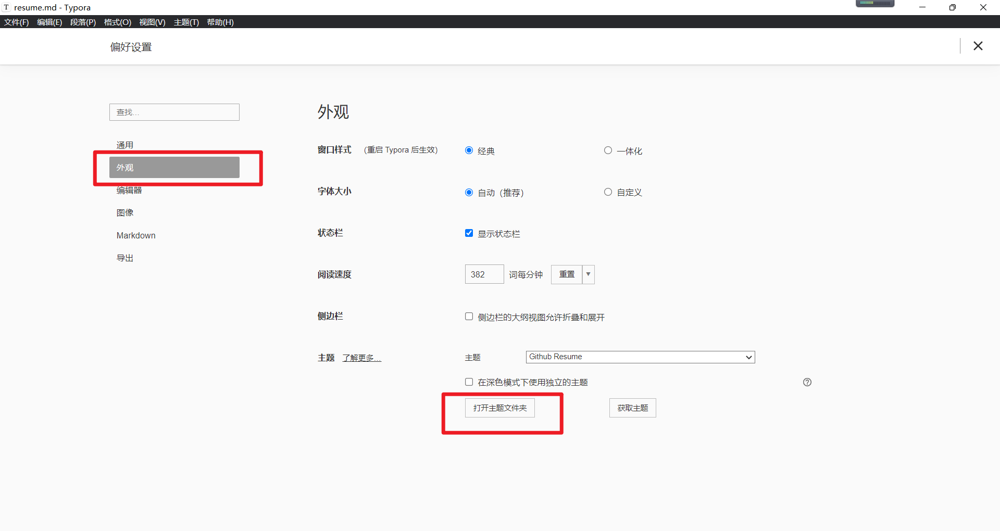
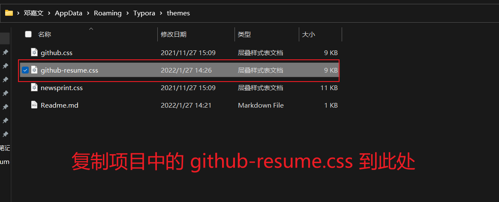
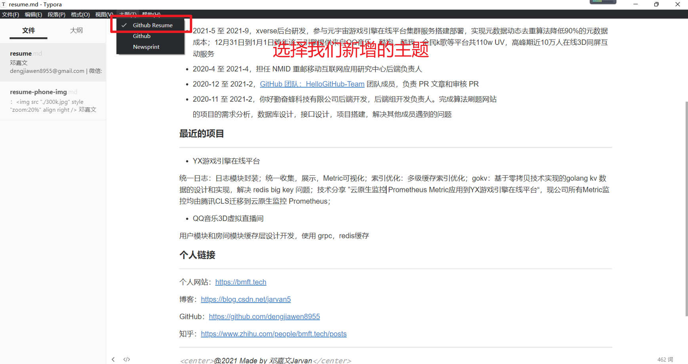
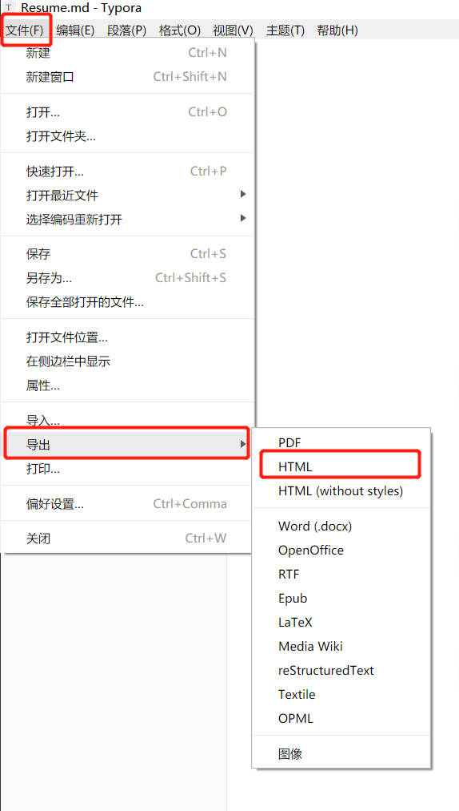

 

 
 
 

# markdown-resume

typroa 简历主题, 保证导出 PDF 简历**刚好一页**

## 1. 功能

* **简单**: 因为不用关心排版, 只需要关心内容
* **面试加分**: 因为面试官也是程序员, 能给面试一定加分
* **一页PDF**: 因为一页的简历更合适面试求职, 该样式会保证简历刚好一页

## 2. 效果

# 快速开始

## 1. 安装 typora

### 1.1. 下载

官网地址: https://typora.io/

中文地址: https://typora.cn/

### 1.2. 安装

安装过程很简单, 就不赘述了

## 2. 将 github-resume.css 复制到 Typora 的主题文件夹

打开typroa-> 文件 -> 偏好配置 -> 外观 -> 打开主题文件夹

重启 typora

## 3. 更换 typroa 主题

## 4. 导出 HTML

修改本项目下的简历模板 resume-template.md 之后导出 HTML 

> 当然你也可以更加自己的喜好不使用 resume-template.md 模板, 自己写一份

文件 -> 导出 -> HTML 

## 5. 打印 PDF

* 使用浏览器打开导出的 HTML
* Ctrl + P 打印, 选择打印机为 PDF

