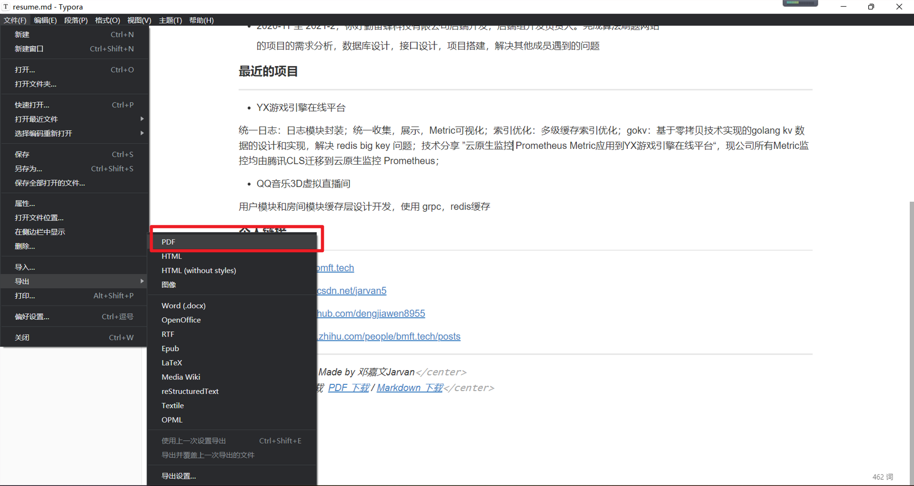

## markdown-resume

Markdown 简历模版, typroa 一键简历生成


### 功能:

* markdown: 程序员使用 markdown 写简历, 简单方便又能给面试一定加分
* pdf 排版紧凑: 更加紧凑的 pdf 导出, 导出的简历只有一页(一页的简历更合适面试求职)

### 使用 typroa 导出简历

#### (1) clone 项目

```bash
git@github.com:dengjiawen8955/markdown-resume.git
```

#### (2) 新增 typroa 主题

复制本项目下的 github-resume.css

粘贴到 typroa 主题文件夹


打开typroa-> 文件 -> 偏好配置 -> 外观 -> 打开主题文件夹


重启 typora

#### (3) 更换 typroa 主题


#### (4) 导出 pdf

修改本项目下的简历模板 resume-template.md 之后导出 pdf 

> 当然你也可以更加自己的喜好不使用 resume-template.md 模板, 自己写一份

文件 -> 导出 -> PDF 




我们可以看到导出的 PDF 紧凑了许多, 很合适用来写简历


